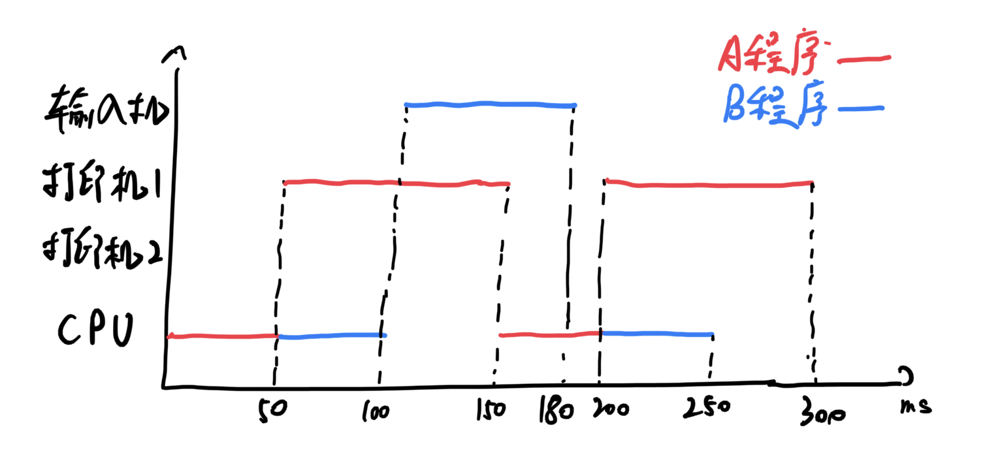

# 第一次理论课作业

## 一

（1）

（2) 有。由图可以看出，在 100ms~150ms 时 CPU 处于空闲状态，原因是A和B都处于I/O阶段，无法使用CPU；在 250ms 后 CPU 也处于空闲状态，原因是 A、B 程序都已经完成计算。

（3）有。程序 B 在 0~50ms 和 180~200ms 时处于等待。

## 二

I~1~ 周转时间 110ms，I~2~ 周转时间 90ms，I~3~ 周转时间 110ms。

CPU 利用率 $= \dfrac{80\text{ms}}{110\text{ms}}=72.7\%$

I~1~ 利用率 $= \dfrac{80\text{ms}}{110\text{ms}}=72.7\%$

I~2~ 利用率 $= \dfrac{90\text{ms}}{110\text{ms}}=81.8\%$

## 三

（1）每个系统架构都有其不同的指令集与硬件结构，彼此有很大差异，因此构建完全可移植的 OS 是不可能的。

（2）一个机器相关层和一个机器独立层。机器相关层屏蔽硬件细节，提供统一接口，为每一个系统架构分别实现；机器独立层无需变化。