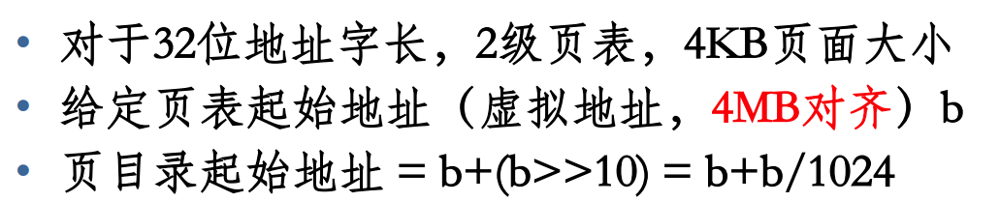

# 第三次理论课作业

1. 

   故为 0x80000000 + 0x200000 = 0x80200000

2. 1) $32$ 位地址，进程地址空间为 $2^{32}=4\text{GB}$；页内偏移量 $12$ 位，一页大小 $4\text{KB}$。

   2) - $0x0$ 页目录位 $0$，查页目录项 $0$： 有效位为 $0$，页面尚未装入，引发缺页中断。
   - $0x00803004 = (0000000010\_0000000011\_000000000100)_2$，页目录位 $(0000000010)_2 = 2$。查页目录项 $2$：有效位为 $1$，页表物理地址 $0x5000$。原地址页表位 $(0000000011)_2 = 3$，查$0x5000$ 处的页表项 $3$：$0x20001$，有效位为 $1$，页面物理地址为 $0x20000$。原地址页内偏移位$(000000000100)_2 = 4$，获取到的数据为 $0x0$。
      - $0\text x00402001 = (0000000001\_0000000010\_000000000001)_2$，页目录位 $(0000000001)_2 = 1$，查页目录项 $1$：有效位为 $1$，页表物理地址0x1000。原地址页表位 $0000000010_2 = 2$，查 $0x1000$ 处，即页目录本身的页表项 $2$：$0x5001$，有效位为 $1$，页面物理地址为 $0x5000$。原地址页内偏移位 $000000000001_2$，获取到的数据为 $0x0$。

   3) 访问物理地址 $0\text x326028$，页内偏移 $0\text x028$，物理页框号 $0\text x326000$，可知虚拟地址页内偏移位为 $(000000101000)_2$。查表得 $0\text x20000$ 处页表的 $1$ 偏移处存有该物理页框号且有效位为 $1$，可知虚拟地址的页表偏移位为 $1$。从页目录中查到页目录项 $3$ 中页表物理地址为 $0\text x20000$ 且标志位为 $1$，可知虚拟地址页目录位为 $(0000000011)_2$。综上，虚拟地址为 $(0000000011\_0000000001\_000000101000)_2=\text{0x00c01028}$。